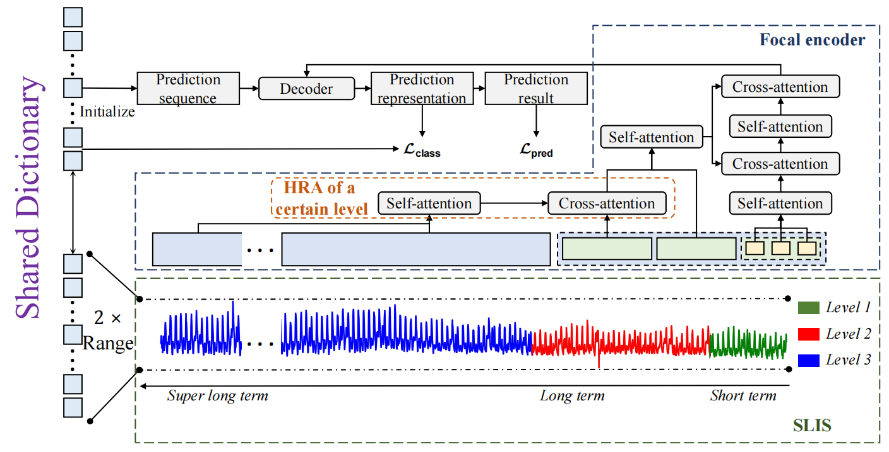
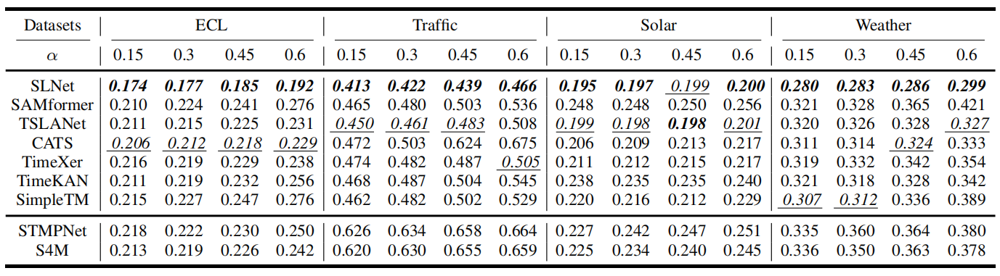
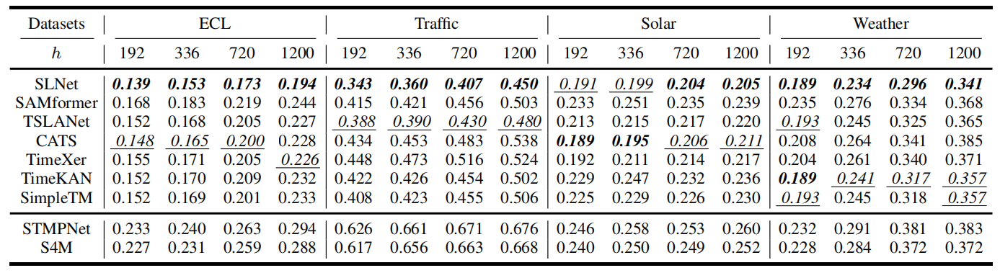

# Super-Long Input Sequences for Long-Term Time Series Forecasting with Missing Values


This is the origin Pytorch implementation of SLNet in the following paper: 
[Super-Long Input Sequences for Long-Term Time Series Forecasting with Missing Values] (Accepted by IEEE Transactions on Instrumentation and Measurement). The data preprocessing, hyperparameter settings, experimental setups (including ablation studies), training duration, hardware specifications, and inference latency can be found in the manuscript.

## Model Architecture

<p align="center">

<br><br>
<b>Figure 1.</b> Overview of the architecture of SLNet, which is composed of four main components: (a) an SLIS with adaptive multilevel segments for different
periodicities, (b) a focal encoder for efficient hierarchical feature extraction, (c) a shared dictionary for tokenizing and initializing predictions, and (d) a decoder
that fuses features and tokens to produce ultimate predictions and confidence scores.
</p>


## Requirements
- python == 3.11.4
- numpy == 1.24.4
- pandas == 1.5.3
- scipy == 1.10.1
- torch == 2.1.0+cu118
- scikit-learn == 1.4.2
- h5py == 3.7.0
- matplotlib == 3.7.1
- loguru == 0.7.2

Dependencies can be installed using the following command:
```bash
pip install -r requirements.txt
```

## Raw Data
ECL, Traffic and Weather dataset were acquired at: [here](https://drive.google.com/drive/folders/1ZOYpTUa82_jCcxIdTmyr0LXQfvaM9vIy?usp=sharing). Solar dataset was acquired at: [Solar](https://drive.google.com/drive/folders/1Gv1MXjLo5bLGep4bsqDyaNMI2oQC9GH2?usp=sharing).

### Data Preparation
After you acquire raw data of all datasets, please separately place them in corresponding folders at `./data`. 

We place ECL in the folder `./electricity`, Traffic in the folder `./traffic`  and Weather in the folder `./weather` of [here](https://drive.google.com/drive/folders/1ZOYpTUa82_jCcxIdTmyr0LXQfvaM9vIy?usp=sharing) (the folder tree in the link is shown as below) into folder `./data` and rename them from `./electricity`, `./traffic` and `./weather` to  `./ECL`, `./Traffic` and`./weather` respectively. We rename the file of ECL/Traffic from `electricity.csv`/`traffic.csv` to `ECL.csv`/`Traffic.csv` and rename its last variable from `OT`/`OT` to original `MT_321`/`Sensor_861` separately.
```
The folder tree in https://drive.google.com/drive/folders/1ZOYpTUa82_jCcxIdTmyr0LXQfvaM9vIy?usp=sharing:
|-autoformer
| |-electricity
| | |-electricity.csv
| |
| |-traffic
| | |-traffic.csv
| |
| |-weather
| | |-weather.csv
```

To standardize the data format, we convert the data file of [Solar](https://drive.google.com/drive/folders/1Gv1MXjLo5bLGep4bsqDyaNMI2oQC9GH2?usp=sharing) from 'solar_AL.txt' to 'solar_AL.csv'. Then we compress this file and upload it at [here](https://github.com/OrigamiSL/FPPformer_MD/tree/master/data/Solar) , where you can get the data file by simply unzipping the 'solar_AL.zip' file.


After you process all the datasets, you will obtain folder tree:
```
|-data
| |-ECL
| | |-ECL.csv
| |
| |-Solar
| | |-solar_AL.csv
| |
| |-Traffic
| | |-Traffic.csv
| |
| |-weather
| | |-weather.csv

```

## Usage
Commands for training and testing SLNet of all datasets are in `./Run.sh`. 

More parameter information please refer to `main.py`.

We provide a complete command for training and testing SLNet:

```
python -u main.py --data <data> --basic_input <input_len>  --pred_len <pred_len> --layer_num <layer_num> --patch_size <patch_size> --bins <bins> --d_model <d_model> --Boundary <Boundary> --learning_rate <learning_rate> --dropout <dropout> --missing_ratio <missing_ratio> --batch_size <batch_size>  --train --train_epochs <train_epochs> <itr> --train --patience <patience> --decay<decay>
```

Here we provide a more detailed and complete command description for training and testing the model:

| Parameter name |                                          Description of parameter                                          |
|:--------------:|:----------------------------------------------------------------------------------------------------------:|
|      data      |                                              The dataset name                                              |
|   root_path    |                                       The root path of the data file                                       |
|   data_path    |                                             The data file name                                             |
|  checkpoints   |                                       Location of model checkpoints                                        |
|   basic_input   |                                           Basic input length                                            |
|    pred_len    |                                         prediction Length                                         |
|     enc_in     |                                                 Input variable number                                                |
|    dec_out     |                                                Output variable number                                             |
|    d_model     |                                             Hidden dims of model                                             |
|    layer_num     |                                             Model stage number                                             |
|   patch_size   |                                Patch size                              |
| Boundary | Boundary for different patch size|
| missing_ratio | Missing_ratio|
|    dropout     |                                                  Dropout                                                   |
|    num_workers     |                                                  Data loader num workers                                                   |
|      itr       |                                             Experiments times                                              |
|  train_epochs  |                                      Train epochs of the second stage                                      |
|   batch_size   |                         The batch size of training input data                          |
|   decay   |                         Decay rate of learning rate per epoch                         |
|    patience    |                                          Early stopping patience                                           |
| bins | bin num |
| learning_rate  |                                          Optimizer learning rate                                           |
| train | whether to train |


## Results
The experiment parameters of each dataset are formated in the `./Run.sh`. You can refer to these parameters for experiments, and you can also adjust the parameters to obtain better mse results or draw better prediction figures. We present the multivariate forecasting results of the four datasets in Figure 2 (with missing values) and Figure 3 (without missing values).

<p align="center">

<br><br>
<b>Figure 2.</b> Forecasting results with missing values.
</p>

<p align="center">

<br><br>
<b>Figure 2.</b> Forecasting results without missing values..
</p>


## Contact
If you have any questions, feel free to contact Li Shen through Email (shenli@buaa.edu.cn) or Github issues. Pull requests are highly welcomed!
